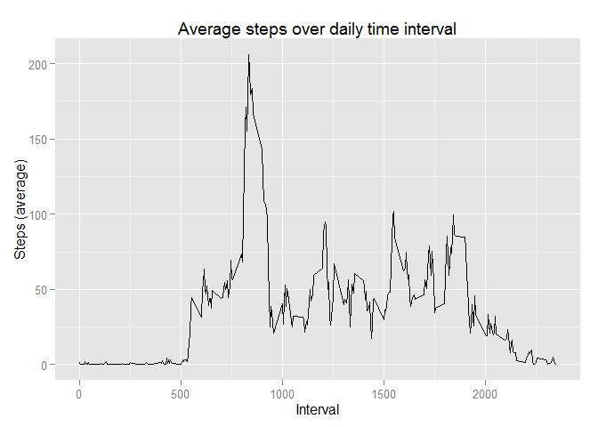
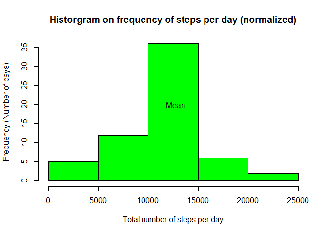
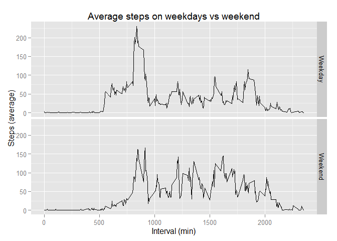

# Reproducible Research: Peer Assessment 1


```r
library(lubridate)
library(dplyr)
library(ggplot2)

## Format display numbers to display without scientific notation
options(scipen=999)
```

## Loading and preprocessing the data

```r
rawDataFile <- "repdata-data-activity.zip"
downloadURL <- "https://github.com/psiu/RepData_PeerAssessment1/raw/master/repdata-data-activity.zip"

if(!file.exists(rawDataFile)){
    download.file(downloadURL, rawDataFile)
}

## Load data from data file
activity <- read.csv(unz(rawDataFile, "activity.csv"))

## Format dates
activity$date <- ymd(activity$date)

activity <- tbl_df(activity)
```


## What is mean total number of steps taken per day?

```r
# Aggregate number of steps per day
daily_steps <- activity %>% group_by(date) %>% summarize(steps = sum(steps))

mean_steps <- mean(daily_steps$steps, na.rm=TRUE)
median_steps <- median(daily_steps$steps, na.rm=TRUE)

hist(daily_steps$steps, col = "green", xlab = "Total number of steps per day", ylab = "Frequency (Number of days)", main ="Historgram on frequency of steps per day")
abline(v = mean_steps, col = "red")
text(mean_steps + 2000, 20 , "Mean")
```

 

Looking at the raw data set:

The **mean** number of steps per day is **10766.19**, denoted by the red line above

The **median** number of steps per day is **10765**


## What is the average daily activity pattern?

```r
interval_avg_steps <- activity %>% group_by(interval) %>% summarize(avg_steps = mean(steps, na.rm=TRUE))

high_score <- max(interval_avg_steps$avg_steps)
high_score_interval <- interval_avg_steps[interval_avg_steps$avg_steps == high_score,]$interval

ggplot(interval_avg_steps, aes(x= interval, y = avg_steps)) +
    geom_line() +
    xlab("Interval") +
    ylab("Steps (average)") +
    ggtitle("Average steps over daily time interval")
```

 

The maximum number of steps during the interval period **835** is **206.17**

## Imputing missing values

```r
num_NA <- sum(is.na(activity$steps))
```

Number of **NA values** in the data step is **2304**

In an attempt to normalize the data, we will replace the null values in the data set with the average value within the same interval.


```r
## Copy data set
activity_norm <- activity
## Replace NA values with imput strategy, using the interval_avg_steps as a lookup table for average interval step value
for(i in 1:nrow(interval_avg_steps)) {
  look <- as.numeric(interval_avg_steps[i,1])
  replacement <- as.numeric(interval_avg_steps[i,2])
  activity_norm[activity_norm$interval == look & is.na(activity_norm$steps),]$steps <- replacement
}

##############
## Evaluate new data set

# Aggregate number of steps per day
daily_steps_norm <- activity_norm %>% group_by(date) %>% summarize(steps = sum(steps))

mean_steps <- mean(daily_steps_norm$steps, na.rm=TRUE)
median_steps <- median(daily_steps_norm$steps, na.rm=TRUE)

hist(daily_steps_norm$steps, col = "green", xlab = "Total number of steps per day", ylab = "Frequency (Number of days)", main ="Historgram on frequency of steps per day (normalized)")
abline(v = mean_steps, col = "red")
text(mean_steps + 2000, 20 , "Mean")
```

 

Normalized data set:

The **mean** number of steps per day is **10766.19**, denoted by the red line above

The **median** number of steps per day is **10766.19**

Imputing the missing values did not have a big impact on the estimated total daily number of steps.


## Are there differences in activity patterns between weekdays and weekends?

```r
## Add weekday / weekend factor
activity_norm$week <- "Weekday"
activity_norm[wday(activity_norm$date) == 1 | wday(activity_norm$date) == 7, "week"] <- "Weekend"
activity_norm$week <- as.factor(activity_norm$week)

## Average the data over interval and weekday/weekend
averaged_norm <- activity_norm %>% group_by(week, interval) %>% summarize(steps = mean(steps))

ggplot(averaged_norm, aes(x = interval, y = steps)) +
    facet_grid(week ~ .) +
    geom_line() +
    labs(title = "Average steps on weekdays vs weekend", x = "Interval (min)", y = "Steps (average)")
```

 
