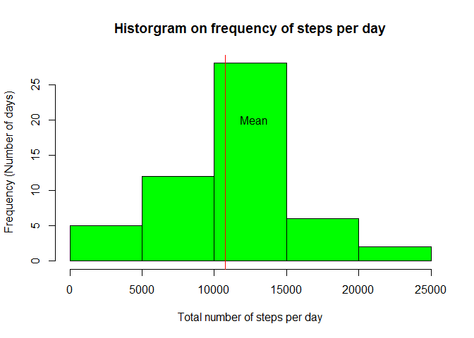

# Reproducible Research: Peer Assessment 1


```r
library(lubridate)
library(dplyr)

## Format display numbers to be integers rather than scientific notation
options(scipen=999)
# 
# inline_hook <- function(x){
#   if(is.numeric(x)){
#     paste(format(x,digits=2))
#   }
# }
# knitr::knit_hooks$set(inline=inline_hook)
```

## Loading and preprocessing the data

```r
rawDataFile <- "repdata-data-activity.zip"
downloadURL <- "https://github.com/psiu/RepData_PeerAssessment1/raw/master/repdata-data-activity.zip"

if(!file.exists(rawDataFile)){
    download.file(downloadURL, rawDataFile)
}

## Load data from data file
activity <- read.csv(unz(rawDataFile, "activity.csv"))

## Format dates
activity$date <- ymd(activity$date)

activity <- tbl_df(activity)
```


## What is mean total number of steps taken per day?

```r
# Aggregate number of steps per day
daily_steps <- activity %>% group_by(date) %>% summarize(steps = sum(steps))

mean_steps <- mean(daily_steps$steps, na.rm=TRUE)
median_steps <- median(daily_steps$steps, na.rm=TRUE)

hist(daily_steps$steps, col = "green", xlab = "Total number of steps per day", ylab = "Frequency (Number of days)", main ="Historgram on frequency of steps per day")
abline(v = mean_steps, col = "red")
text(mean_steps + 2000, 20 , "Mean")
```

 

Looking at the raw data set:

The mean number of steps per day is 10766.19, denoted by the red line above

The median number of steps per day is 10765


## What is the average daily activity pattern?


## Imputing missing values


## Are there differences in activity patterns between weekdays and weekends?

